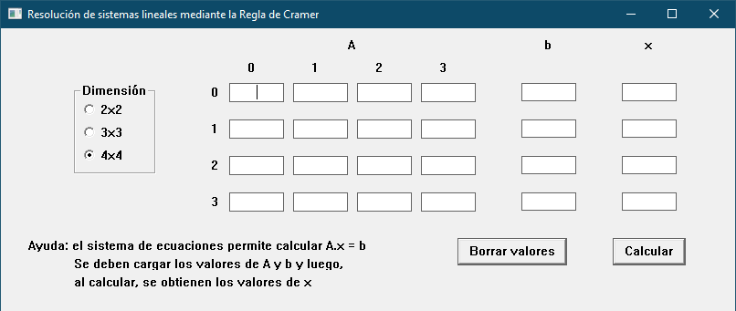

# C Matrix Calc with win32api

This app is a matrix calculator, that uses win32api to show window and widgets. Logically, it is made for Windows. I did it for a subject, but it has some interesting features that would help you with understanding of win32api GUI.

## Features

It is able to:

 - Calculate matrix product using Cramer, of 2x2, 3x3 and 4x4 dimensions.
 - Enables and disables entries depending on matrix size.
 - Clears all.
 - Changes to next entry with Tab.
